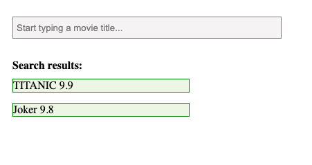

# JavaScript-Onboarding
practice and learn javascript basic and advanced functionality

### 1. AJAX - Vallina Javascript
#### Attention

`If you want to run this application, Please replace and use your own API service!`.

* **GET XMLHttpRequest**

* **POST XMLHttpRequest**

### 2. JSON - implementation for CORS
  Refer to this article: [Blog Link](https://jialihan.github.io/blog/#/javascript/jsonp)

### 3. Iframe - implementation for CORS GET & POST

  Refer to this article: [Blog link](https://jialihan.github.io/blog/#/javascript/iframecors)

### 4. Form

* JS-html-form: [Article: handling forms](https://jialihan.github.io/blog/#/javascript/form-js)
* React-form: connect to state

### 5. Search Input Module - JS
with optimization:
* Cache Memo
* Debounce: avoid user typing too fast

### 6. DOM-Manipulation
* Add list item
* modal open/close
* cancel/confirm button events
* **Delete list item**: important: two ways
#### 6.1 Javascript version

#### 6.2 React version
build react item list, with add and remove capability, manage with local status.

### 7. count down timer
Javascript [setInterval()](https://www.w3schools.com/jsref/met_win_setinterval.asp)

### 8. google search bar with auto complete

### 9. Window Post Infinite Scroll

