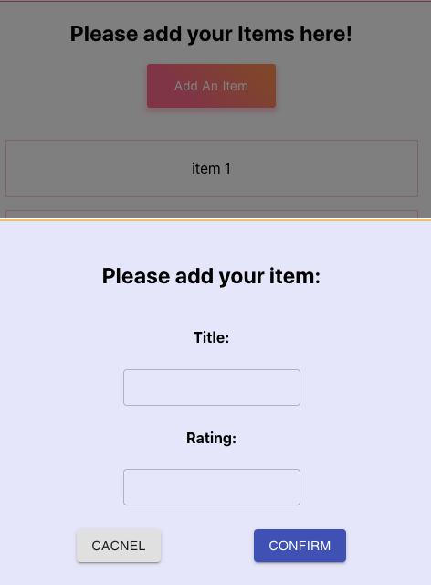

### How to run this project?
`npm start`

### Use outside UI library 
[Material UI](https://material-ui.com/)
* Button
* TextField
* Modal

### local state to manage item list status

### Add an Item
get and submit data from modal inputs

### Delete an Item
on hover the item, click the delete button to confirm to delete the item.

### snapshot
